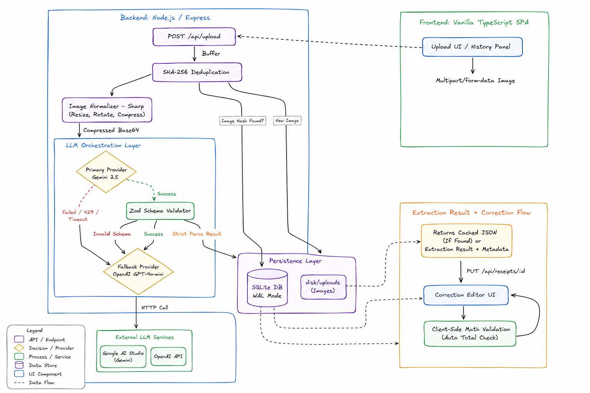
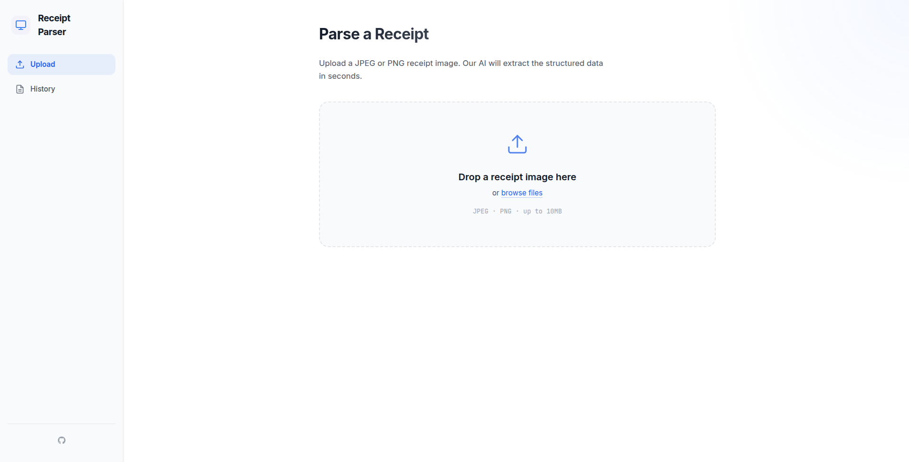
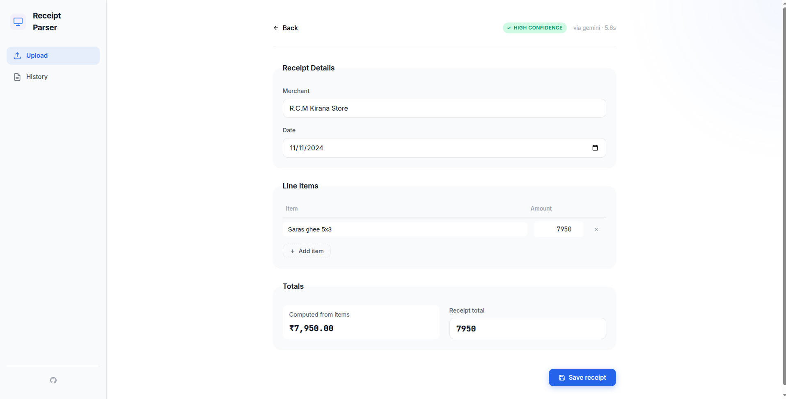
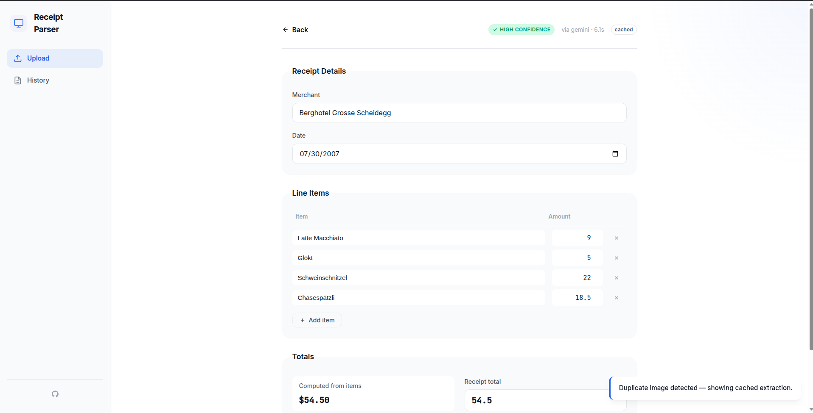
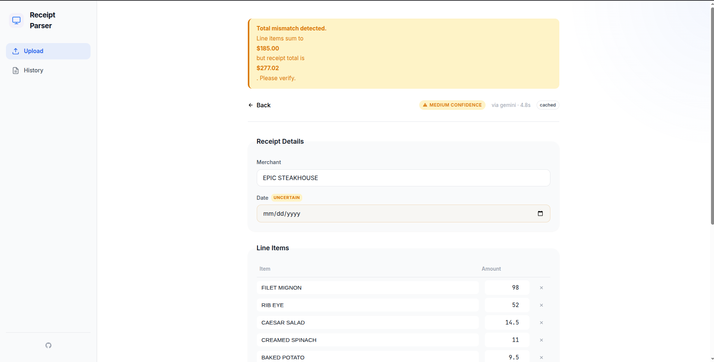
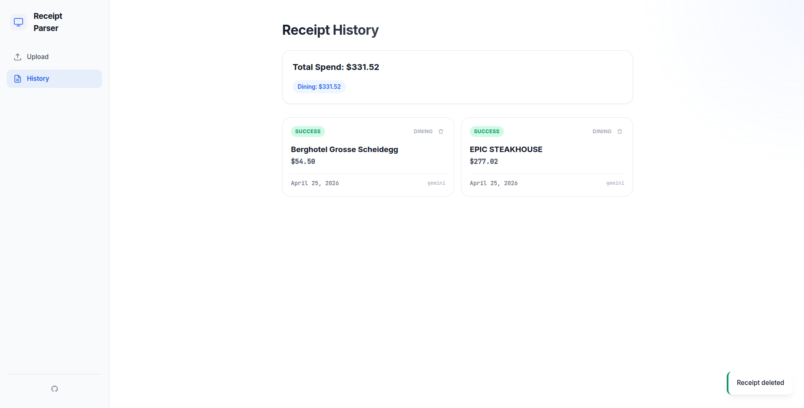

# Abstract

This project is a receipt parsing pipeline that uses LLMs to extract structured data from receipt images. It is built with Express.js and TypeScript on the backend, and vanilla TypeScript on the frontend. It uses SQLite for local storage and Sharp for image processing.

---

# Architecture



To build this, I knew from the start that treating LLMs like magic doesn't work. LLMs hallucinate, they timeout, and they sometimes return completely broken JSON. So, I approached this by designing a pipeline that defends against these failures at every step.

Here is exactly how the architecture evolved:

1. The "Correction-First" Data Contract Before I wrote any code, I locked down a strict data schema using Zod. My rule was simple: if the LLM returns an array instead of a string, or forgets a total, we drop it immediately and mark the extraction as failed. On the frontend, I intentionally built a "Correction-First" UI. The app automatically runs math checks to ensure Sum(Line Items) == Receipt Total. If the numbers don't match, the UI throws a "Total Mismatch Warning" so the user can fix the LLM's mistake before saving.

2. Optimizing the Images (Sharp & SHA-256) Uploading massive 10MB iPhone photos to an LLM API is super slow and wastes tokens. So, I added a middleware using Sharp to automatically resize, compress, and strip EXIF data before sending the image. I also added a SHA-256 hashing layer. If a user uploads the exact same receipt twice, my backend detects the duplicate hash and returns the parsed result straight from the local Database, completely skipping the 10-second API delay.

3. The Primary-Fallback Orchestrator Relying on just GPT-4o for everything is way too expensive, but relying on a cheaper model alone means a higher failure rate. To fix this, I built an LLM Orchestrator. The pipeline first tries to parse the image using Gemini 2.5 Flash because it is extremely fast and cheap. If Gemini hits a rate limit (like a 429 error) or gets confused by the schema, the backend silently catches the error and falls back to OpenAI GPT-4o-mini. This gives us the speed of a cheap model for 90% of requests, but the reliability of a smarter model for the edge cases.

4. Why SQLite? For the database, I made a strict business decision to use better-sqlite3 embedded directly in the app. Since I configured it in WAL (Write-Ahead Logging) mode, it handles concurrent transactions perfectly. Setting up a full PostgreSQL Docker container for a local-first receipt parser is massive overkill. SQLite gave me the speed and simplicity I needed without the ops headache.

---

# Live Link

<https://receipt-parser-3z5n.onrender.com/>

*(Deployed on Render — if API credits are exhausted, clone locally and use your own key)*

---

# Quick Start (Run Locally in 1 Click)

1. **Clone the repo:**

   ```bash
   git clone https://github.com/shivamchaubey027/receipt-parser.git
   cd receipt-parser
   ```

2. **Add your API Keys:**
   Create a `.env` file in the `backend/` directory:

   ```bash
   OPENAI_API_KEY=sk-your-key-here
   GEMINI_API_KEY=AIzaSy-your-key-here
   LLM_PROVIDER=openai
   ```

3. **Run with a single command:**
   If you have Docker installed, the entire project spins up natively:

   ```bash
   docker-compose up --build
   ```

   *(Or if using Node: run `npm run install:all` then `npm run dev` from the root).*

   The application will be instantly live at **<http://localhost:5173>** (or <http://localhost:3001> if using Docker).

# Phase 1: Planning and RFC

Before writing any code, I created an RFC (Request for Comments) document to define the data contracts and choose the technology stack clearly.

### Data Contract

I defined a strict single source of truth using Zod schemas. If the LLM response does not match the schema exactly—for example, if a required value is missing or a field type is incorrect—the extraction is immediately marked as failed.

### Tech Stack Decisions

**Backend:** Express with TypeScript
Chosen because it is simple, fast, and flexible without unnecessary abstraction.

**Database:** SQLite using better-sqlite3
I selected embedded SQLite running in WAL (Write-Ahead Logging) mode. This provides fast concurrent transactions without needing to manage a separate PostgreSQL container.

**Frontend:** Vanilla TypeScript SPA
I intentionally avoided frameworks like React or Vue. This kept the project lightweight and allowed faster DOM updates with a smaller scope.

---

# Phase 2: Iterative Development

## Iteration 1: Making the Pipeline Efficient and Safe

Uploading large receipt images (like 10MB iPhone photos) directly to an LLM API is slow and expensive.

To solve this:

* I used **Sharp** to resize images, compress them, and remove EXIF metadata before sending them to the API
* I implemented **SHA-256 hashing** for deduplication

If the same receipt is uploaded again, the backend detects it from the stored hash and immediately returns the cached result from SQLite. This avoids unnecessary API calls and removes the 10-second LLM delay.

---

## Iteration 2: Improving Reliability with a Fallback Orchestrator

Using only one expensive model like GPT-4o for all receipts increases cost. Using only a cheaper model reduces reliability.

To solve this, I built an **LLM Orchestrator**.

Pipeline behavior:

1. First attempt parsing with **Gemini 2.5 Flash** (fast and low cost)
2. If it fails due to rate limits, timeout, or schema mismatch
3. Automatically fallback to **GPT-4o-mini**

This ensures both performance and reliability without affecting the user experience.

---

## Iteration 3: Correction-First UI Design

OCR systems are never fully accurate. Because this is a finance-related tool, the interface must assume errors can happen.

So I designed the frontend editor to validate extracted values automatically.

Examples:

* If line items total $14.00 but receipt total is detected as $15.50
* The UI shows a **Total Mismatch Detected** warning
* The user must review the difference before saving

Fields with low confidence are also highlighted so users know exactly where manual correction is needed.

### Images



### Editor View





### History Dashboard



---

# Major Tradeoffs and Decisions

## Vanilla TypeScript Instead of React or Vue

I built the frontend as a pure TypeScript SPA using a Controller + DOM factory pattern.

Reason:

This project focuses mainly on correction workflow UX. Using a heavy framework with a virtual DOM and complex tooling would be unnecessary overhead. Vanilla TypeScript keeps performance high and dependencies minimal while still supporting strict typing with backend schemas.

---

## Synchronous SQLite Instead of Async PostgreSQL

I used **better-sqlite3** in synchronous mode.

Reason:

Since SQLite runs locally inside the application, asynchronous wrappers only add extra Promise overhead without real benefit. Direct synchronous access is faster and simpler here.

---

## Multi-Model Strategy Instead of Single Heavy Model

Instead of sending every request to one expensive model, I implemented a primary-fallback orchestration strategy.

Reason:

This keeps most requests fast and cheap while still handling edge cases reliably.

---

# How I Used LLMs During Development

I used LLMs as a pair-programming assistant throughout the assignment.

Main use cases:

* Planning project structure and generating initial TypeScript scaffolding
* Improving prompts so the model outputs clean JSON without Markdown formatting
* Converting UI design ideas into a working CSS Custom Properties theme

---

# What I Would Improve With One More Week

## Separate OCR from NLP Parsing

Currently, the vision model handles both text reading and structure understanding.

With more time:

I would first extract raw text using a traditional OCR system like **AWS Textract**, then send only the text to the LLM for structured parsing. This would reduce hallucinations and improve speed.

---

# What would you push back on if I were your PM?

The spec says 'save the corrected version' without defining what the original extraction is for downstream. If there's no audit use case, we're storing redundant data. I'd push back and ask: is the goal correction-as-feedback-loop (use diffs to improve the prompt over time), or correction-as-record-keeping? One needs a diff table, the other just an edited_json column. I assumed the latter but this should be aligned before building in production.

## Deployment to Render

The project is already Dockerized.

I have deployed it to Render, the smaller issue with it is that I have exhausted the api credits for the free tier of gemini and openAI.

<https://receipt-parser-3z5n.onrender.com/>
---

Thanks For Reading!
